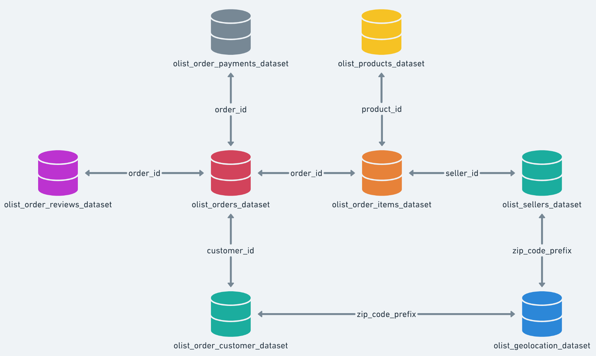

# Brazilian E-Commerce SQL Analysis in DuckDB

This project explores 100K rows of e-commerce transactions in Brazil using DuckDB.

## Dataset:
- Download at: https://www.kaggle.com/datasets/olistbr/brazilian-ecommerce/data

## Files
- `brazil_ecom.db` — the DuckDB file you can open with `duckdb brazil_ecom.db --ui`
- `data/` — contains the raw CSV files from Kaggle
- `notebooks/` —  SQL code in notebook format

